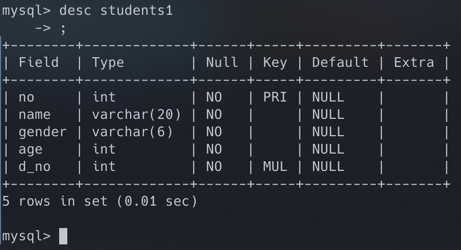
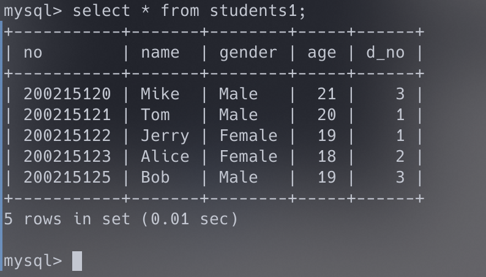
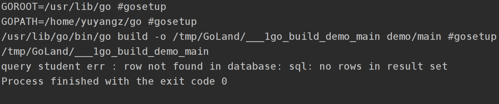

> 我们在数据库操作的时候，比如Data Access Object(DAO)层中当遇到一个sql.ErrNoRows的时候，是否应该wrap这个error,抛给上层。为什么？应该怎么做，请写出代码。

应该要wrap这个error，抛给上层。因为只是一次没有查找到数据，并不至于需要让整个系统崩溃，具体如何影响业务，应由上层的业务逻辑决定。

此处实现了一个简单的demo，service层实现业务逻辑，需要拿到dao层的数据，若在dao层中遇到sql.ErrNoRows，应该wrap起来给service层处理。此处service层直接打印出log。

## 数据库说明

采用本学期学校数据库实验的一个案例，db_lab数据库下students1表格定义如下：

表格中的信息如下：

## 运行情况

访问学号为123456的同学，找不到结果，返回一个wrap好的error。

运行结果如下：

